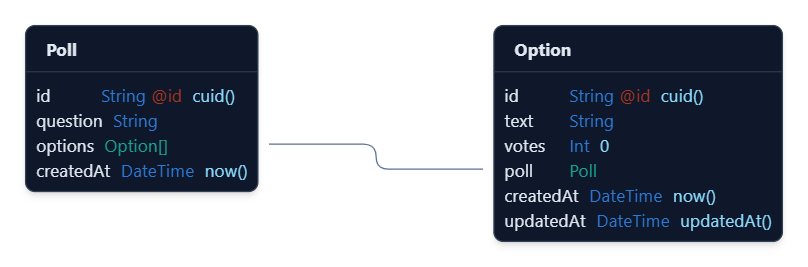

# Full Stack Test - Polling App

## Task

- Title: Quick Polling App
- Task: Create a simple polling app where a user can:
  - Create a poll with a question and multiple options.
  - Vote on a poll.
  - View poll results in real-time (auto-refresh every 5 seconds).

## Technologies Used

- Next.js
- Tailwind CSS
- Shadcn UI
- Prisma ORM
- PostgreSQL
- Docker

## API Endpoints

- GET api/v1/polls - for fetching all the polls
- POST api/v1/polls - for creating a new poll
- POST api/v1/polls/vote - for voting in a poll

## Database Schema

